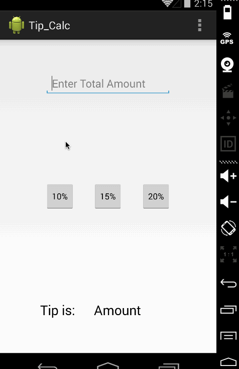

#Project 1 Tip Calculator

Time Spent: 1 Hr

Completed User Stories:
	
* [x] Required: User is displayed the tip of specified percentage for specified entered amount
	
* [x] Required: User enters the total amount of the transaction
	
* [x] Required: User can select between tip amounts (i.e 10%, 15%, 20%)
	
* [x] Required: Upon selecting tip amount, formatted tip value is displayed

Notes: LiceCap does not work when using multiple monitors

